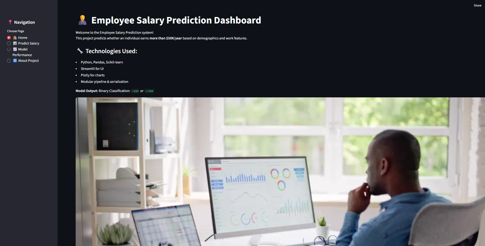
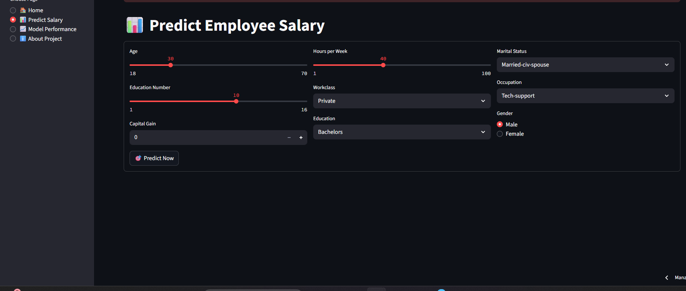
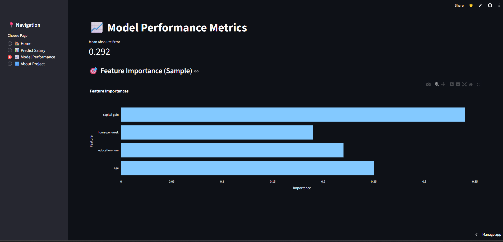

# Employee Salary Prediction Dashboard

An interactive and advanced web dashboard that predicts employee salaries based on demographic and professional attributes — built using **Machine Learning**, **Streamlit**, and **Plotly**.

🔗 [Live App](https://employeesalaryprediction-adfch6k3amimvde54ejfem.streamlit.app/)

---

## Features

-  Clean and dynamic **visualizations** using Plotly
-  **Predictive model** trained using Scikit-Learn
-  Modular project structure (components, pipeline, utils)
- Model loading using `dill` and custom pipeline
- Exploratory Data Analysis with trends and insights
- Streamlit-based **interactive web UI**
- Handles errors and invalid inputs gracefully

---

## Machine Learning

- Model: `Employee Salary Predictor`
- Dataset: Employee attributes with salary labels
- Target: Income Prediction
- Pipeline: Preprocessing ➝ Training ➝ Evaluation ➝ Prediction

---

##  Tech Stack

| Category          | Tools / Libraries              |
|------------------|-------------------------------|
| Frontend UI      | Streamlit, Plotly, Seaborn     |
| Machine Learning | scikit-learn, pandas, numpy    |
| Utilities        | dill, matplotlib, os, sys       |
| Hosting          | Streamlit Cloud                |
| Version Control  | Git & GitHub                   |

---

##  Preview Screenshots

> _Save these images to `assets/` folder and link them below in your markdown._

| Dashboard View | Input Form | Prediction Output |
|----------------|------------|-------------------|
|  |  |  |

---

##  How to Run Locally

1. Clone the repository

```bash
git clone https://github.com/SaiVarunPappla/Employee_Salary_Prediction.git
cd Employee_Salary_Prediction
```

2. Create a virtual environment and install requirements

```bash
Copy code
pip install -r requirements.txt
```

3. Run the app

```bash
Copy code
streamlit run streamlit_app.py
```

Deployment :
This project is deployed on Streamlit Cloud.

Automatically installs dependencies from requirements.txt

Deploys from streamlit_app.py as the entry point

Streamlit Cloud URL:
➡ https://employeesalaryprediction-adfch6k3amimvde54ejfem.streamlit.app/

 Author
Sai Varun Pappla
LinkedIn : [https://www.linkedin.com/feed/](https://www.linkedin.com/in/pappla-sai-varun-874902200/)
